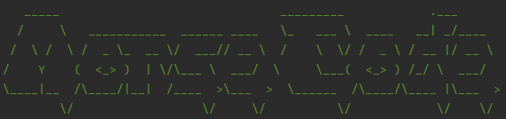
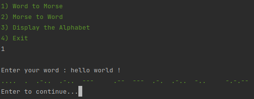
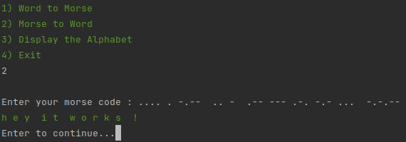
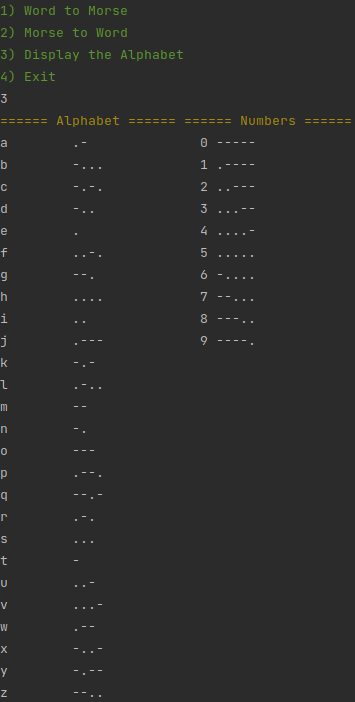

<h1 style="text-align:center;">Morse Translator</h1>

<h4>This script is able to translate morse to clear text and clear text to morse</h4>

  

<h3>Requirements</h3>
- Python 3  

This script only works with my self-made library, that you can find here :
- https://github.com/lisandro-git/utilities-py  
Clone the repository, add the utilities.py in your project folder, and your good to go !
  

 
If you want to convert clear text to morse, you simply need to do that :

  
In the other hand, if you want to convert morse code to clear text :

  
The tricky thing about convert morse code to clear text is that each letters has to have 
one space between them, and each words has to have two spaces between them

If you have any doubts about the morse alphabet, you can consult the alphabet table : 
  
It shows the morse alphabet, including the prosigns, number and special characters.

That's all you need to know about this script ! Feel free to fork this project, make some
Merge Request and all of those stuff in order to make this project grow !
